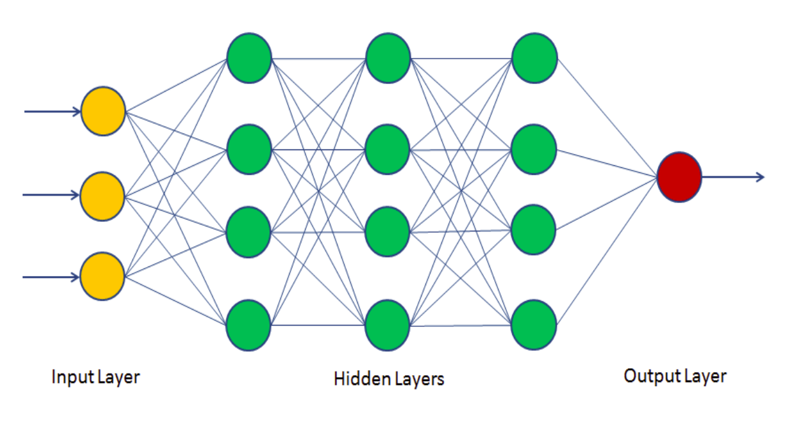
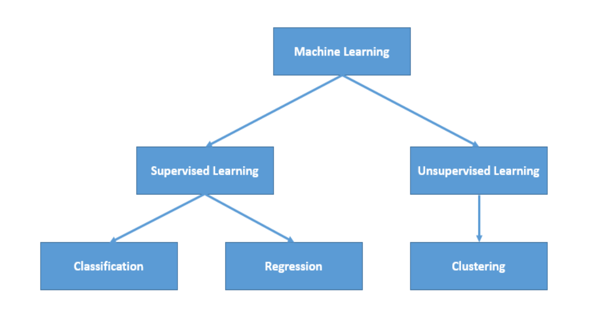

#### AI 的分类

#### AI neural network

每个神经元是一个信息的处理单元，其工作模型如下：

三个基本的组成部分
- 权重 weights
- 累加器 adder，线性累加，实际是加权平均
- 激活函数 activation function，非线性的运算

数学公式可表达为：
$$ v_k = \sum_{j=0}^{m} w_{kj} x_j $$
$$ y_k = \varphi(v_k) $$

#### 典型的激活函数
**Binary Function**
- Unipolar binary function
$$ f(x) = 
\begin{cases} 
1 & x \geq 0 \\
0 & x < 0 
\end{cases} $$

- Bipolar binary function
$$ f(x) = 
\begin{cases} 
1 & x \geq 0 \\
-1 & x < 0 
\end{cases} $$

**Piecewise-Linear Function**
$$ f(x) = 
\begin{cases} 1 & x \geq 0.5 \\
x + 0.5 & -0.5 < x < 0.5 \\
0 & x \leq -0.5
\end{cases} $$

*以上的激活函数都不可微。*
**Sigmoid Function**
$$ f(x) = \frac{1}{1 + e^{-x}} $$
输出为（0，1）

**Hyperbolic Tangent Function**
$$ f(x) = \frac{e^x - e^{-x}}{e^x + e^{-x}} $$
输出为（-1，1）

**Relu Function**
$$ f(x) = \max(0, x) $$

#### 神经网络架构
**前向神经网络 Feed-Forward Neural Network**

最简单的情况是单层神经网络，只有输入层和输出层。

而多层神经网络包含多个隐藏层，通过隐藏层捕捉非线性关系。

**循环神经网络 Recurrent Neural Network**

相比于前馈神经网络，增加反馈回路。因此可以处理序列数据以及时间序列数据。具有短期的记忆能力。

**神经网络的使用**
- 开发阶段
  包括选择合适的架构、确定神经元的权重以及训练、测试模型
- 部署阶段
  将已经开发好的模型，部署到实际的应用中

**训练神经网络**

神经网络的训练是通过已知的知识，使用合适的算法，调整确定神经网络中各个权重的过程。

- 数据集
  - 先验信息：已知的事实，包括经存在的知识。（prior knowledge）
  - 观测数据：传感器采集的数据，可以是labelled 或者 unlabeled
  
- 数据集划分
  训练集、验证集、测试集

- overfitting 过拟合 underfitting 欠拟合
  过拟合指在训练集上表现很好，但在测试集上表现很差。欠拟合是指在测试集和训练集上都表现很差。

根据不同的调节权重的算法方式可以分为以下三种学习规则
- 误差校正学习 Error-correction learning
- 赫布学习 Hebbian learning
- 竞争学习 Competitive learning

**Error correction learning**

权重调整根据误差来调整，误差是指**目标值target** 与 **输出值output** 之间的差异。

其公式为：
$$ \Delta w_{kj}(n) = \eta e_k(n) x_j(n) $$  

$$ w_{kj}(n+1) = w_{kj}(n) + \Delta w_{kj}(n) $$

其中：$w_{kj}(n)$ 为第n次迭代时的权重，$\Delta w_{kj}(n)$ 为第n次迭代时的权重变化量，$\eta$ 为学习率，$e_k(n)$ 为第n次迭代时的误差，$x_j(n)$ 为第n次迭代时的输入。

可知权重的变化量$\Delta w_{kj}(n)$ 与 误差$e_k(n)$ 和 输入$x_j(n)$ 成正比。

**Hebbian learning**

赫布学习规则为：
- 如果连接两侧的神经元同时被激活，则连接强度，即权重，会增加
- 如果连接两侧的神经元异步激活（一个激活，一个未激活），则连接强度会减弱

其数学公式为：
$$ \Delta w_{kj}(n) = \eta x_j(n) y_k(n) $$

其直观理解为：如果$x_jy_k >0$，则表示输入输出同时为正/负，则权重增加。否则权重减少。

**Competitive learning**

一组相同的神经元，在受到外界刺激的时候输出激活值不一样。通过竞争的方式，确定获胜的神经元，更新获胜神经元的权重。
其数学公式为：
$$ \Delta w_{kj} = 
\begin{cases} 
\eta (x_j - w_{kj}) & \text{for winning neuron} \\
0 & \text{for others} 
\end{cases} $$

其直观理解为：获胜的神经元向输入靠拢，使其更加擅长识别类似的模式，即下次还会赢。而其他神经元的权重不变。也可以理解为空间中的向量，即下一次更新的方向为输出的神经元指向输入神经元方向。类似kmeans 中的质心不断向输入逼近。

主要应用于聚类，模式识别等无监督学习中。

#### 无监督学习和监督学习

