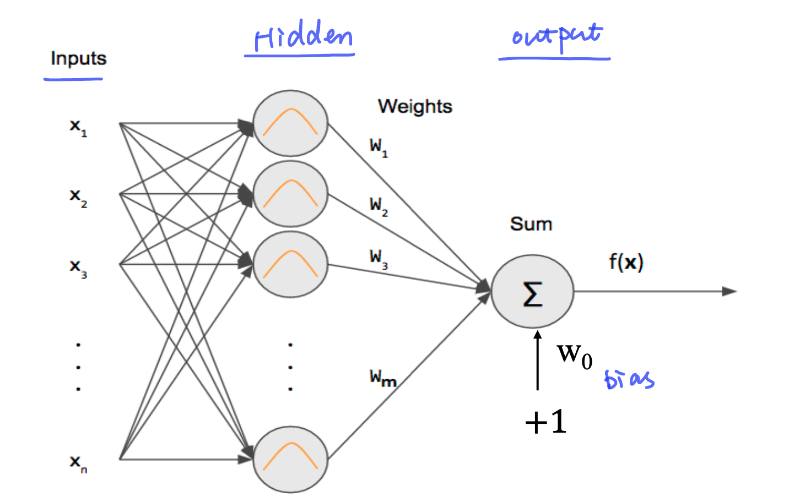
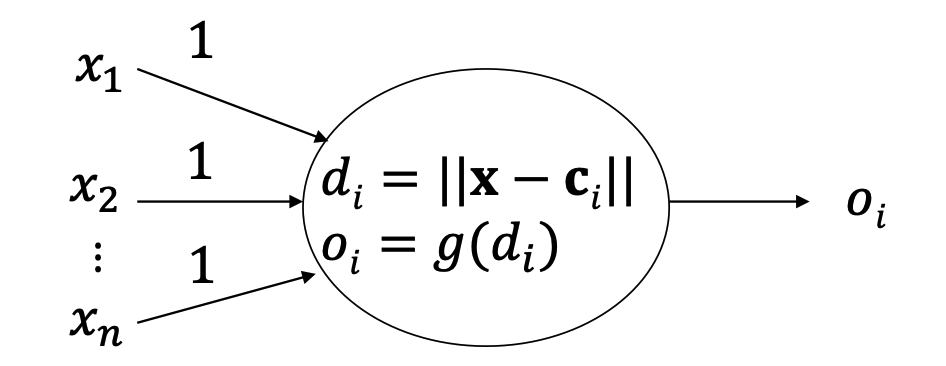
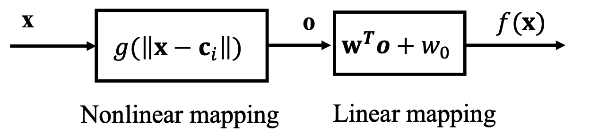
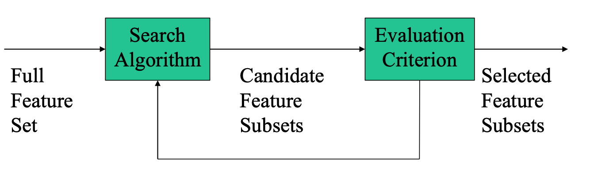

#### RBF

RBF 的灵感来源是人类的视觉皮层,视觉皮层中有大量的神经元,每个神经元只对特定区域的刺激敏感,而对其他区域的刺激不敏感。RBF 网络的基本思想也是仅针对局部区域敏感的神经网络。

RBF是一种前馈神经网络,包含输入层、隐藏层和输出层。

- 输入层
  输入层不进行任何运算,仅仅只是传递信号,故与隐藏层之间的所有权重都设置为1
- 隐藏层
  隐藏层设置为局部敏感的神经元，且随着距离的增大，响应减少
  
  其中，$c_i$为中心向量，也就是神经元i的中心点。$g$为径向基函数，常用的径向基函数
  - 高斯函数：
  $$
  g(x) = \text{exp}(-\frac{d_i^2}{2\sigma_i^2})
  $$
  其中，$\sigma_i$为高斯函数的标准差，决定了高斯函数的宽度。$\sigma$越大越宽。
  - inverse multi-quadric函数：
  $$
  g(x) = \frac{1}{\sqrt{d_i^2 + \sigma_i^2}}
  $$

- 输出层
  输出层为线性叠加层
  $$f(\mathbf{x}) = \sum_{j=1}^{m} w_j o_j(\mathbf{x}) + w_0$$
  
  其中，$w_j$为权重，$o_j$为隐藏层的输出，$w_0$为偏置项。

**因此影响RBF神经网络的因素有：**
- 中心向量$c_i$
- 径向基函数的类型以及$\sigma$的选择
- 隐藏层与输出层的权重$w_j$的选择

可以将RBF神经网络看作：

第一步：Nonlinear Mapping, 找到hidden layer 的中心位置（SOM，K-means）
第二部：linear mapping, 学习输出层的权重

**确定center vector**

核心目标是选取的centre vector 可以代表整个输入的空间分布特征。

- 随机从训练样本集中选取
  选用Gaussian RBF函数，$\sigma$的选择可以使用经验公式:
  
  $$\sigma = \frac{d_{max}}{\sqrt{2m}}$$
  
  其中，$d_{max}$为样本集中最大距离，$m$为隐藏层神经元个数.

  随机抽取样本的方法虽然简单，但如果选取少量神经元的话，不能保证收敛。
- SOM
- 聚类方法：k-means

**Feature Selection**

Center vector 的选择也可以看作一个feature selection 的过程。选择线性可分的特征。
从隐藏空间的N个特征中选择最大分离性的m个特征。有两个方法可以评估其可分性：
- Mahalanobis distance
  用于衡量各类别中心点之间的距离 衡量类别间的可分性
  $$J=(m_1-m_2)^TC^{-1}(m_1-m_2)$$
  
  其中$m_1,m_2$为两个类别的中心点，$C$为协方差矩阵。

- scatter-based distance
  评估类间分离度 和 类内紧密度。类间分离度大，类内紧密度小更容易线性可分。
  $$J=\frac{tr(S_b)}{tr(S_w)}$$
  
  其中$S_b$为类间散度矩阵，$S_w$为类内散度矩阵。
  $$S_b=(m_1-m_2)(m_1-m_2)^T$$
  
  $$S_w = S_1 + S_2$$

  $$S_i=\sum_{x_k\in X_i}(x_k-m_i)(x_k-m_i)^T$$

  
在feature subset selection算法中，包含两部分：

- search algorithm
  确定候选feature 的子集
  - bottom-up 自下而上
    从空集开始，不断的向集合中增加元素。sequential forward selection
  - top-down 自上而下
    从全集开始，不断的从集合中删减元素。sequential backforward selection
- evaluation criterion
  评估候选子集的好坏

**weight updates**
最小二乘法更新权重
  