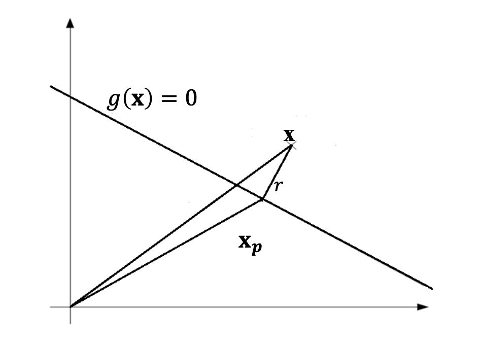

## Outline

- 线性SVM
- 非线性SVM

## 线性SVM

线性分类器的主要目的是：寻找一个超平面可以准确的并且具有较高置信度的对数据进行二分类。

其数学表达式为：

$$
\mathbf{w}^T \mathbf{x} + b = 0
$$

其中 $\mathbf{w}^T$ 为法向量，$b$ 为偏置项。

因此，SVM的目标可以转化为：寻找到使分类间隔最大化的超平面。此超平面可以作为最优超平面。

推导公式如下：

$$
g(x)=\mathbf{w}^T \mathbf{x} + b
$$

不同类别的数据为：

$$
\mathbf{w}^T \mathbf{x} + b \geq 1 \quad \text{for } d = +1
$$

$$
\mathbf{w}^T \mathbf{x} + b \leq -1 \quad \text{for } d = -1
$$

由图可知：

$$
\mathbf{x} = \mathbf{x}_p + (\mathbf{x} - \mathbf{x}_p) = \mathbf{x}_p + r \frac{\mathbf{w}}{\|\mathbf{w}\|}
$$

其中：$\mathbf{x}_p$ 是 $\mathbf{x}$ 在超平面的投影，而 $r$ 表示其到超平面的距离

因此将其带入 $g(x)$ 可得：

$$
\begin{aligned}
g(\mathbf{x}) &= \mathbf{w}^T \mathbf{x} + b \\
&= \mathbf{w}^T \left( \mathbf{x}_p + r \frac{\mathbf{w}}{\|\mathbf{w}\|} \right) + b \\
&= \mathbf{w}^T \mathbf{x}_p + b + r \frac{\mathbf{w}^T \mathbf{w}}{\|\mathbf{w}\|} \\
&= g(\mathbf{x}_p) + r \|\mathbf{w}\|
\end{aligned}
$$

因为  $g(\mathbf{x}_p)=0$ 因此可得到：

$$
r = \frac{g(\mathbf{x})}{\|\mathbf{w}\|}
$$

因此可得到：

$$
r = \frac{g(\mathbf{x}^{(s)})}{\|\mathbf{w}\|}
= \begin{cases}
\frac{1}{\|\mathbf{w}\|}, & \text{for } d^{(s)} = +1 \\
\frac{-1}{\|\mathbf{w}\|}, & \text{for } d^{(s)} = -1
\end{cases}
$$

所以两个分类的间隔为：

$$
\rho = \frac{2}{\|\mathbf{w}\|}
$$

综上：最大化分类间隔 $ \rho$ 也就是最小化 $\|\mathbf{w}\|$

故SVM可转化为优化问题：

$$
MIN \ J(\mathbf{w}) = \frac{1}{2} \mathbf{w}^T \mathbf{w}
$$

$$
S.t. \ \ d(i) \times \left[ \mathbf{w}^T \mathbf{x}(i) + b \right] \geq 1 \quad \text{for } i = 1,2, \dots, N
$$

根据拉格朗日乘子（Lagrange Multipliers）计算得到：

$$
\mathbf{w}^* = \sum_{i=1}^{N} \alpha(i) d(i) \mathbf{x}(i)
$$

$$
b^* = 1 - (\mathbf{w}^*)^T \mathbf{x}^{(s)}
$$

**Soft Marigin**

软间隔SVM允许一定程度的分类错误，以适应数据中可能存在的噪声和不可分数据点。其数学公式转化为：

$$
d(i) \times \left[ \mathbf{w}^T \mathbf{x}(i) + b \right] \geq 1 - \xi(i)
$$

其最优解为：

$$
\mathbf{w}^* = \sum_{i=1}^{N} \alpha(i) d(i) \mathbf{x}(i)
$$

$$
b^* = 1 - (\mathbf{w}^*)^T \mathbf{x}^{(s)}
$$

## Kernel SVM

核心是将数据 $\mathbf{x}$ 通过非线性映射到高维线性空间，后应用SVM处理。

**Cover's Theorem 科夫定理：**

在一个多维输入空间内，如果数据模式是非线性可分的，那么可以将一个非线性映射将其投影至更高维的特征空间，使得数据具有更高的概率变的线性可分。

- 映射必须为非线性的
- 特征空间的维度足够高。即如果特征空间足够高，每个样本都具有足够的自由度进行分离。这也是为什么深度学习通常在高维空间表现的更好。

计算方法类似线性SVM 可得到：

$$
\mathbf{w} = \sum_{i=1}^{N} \alpha(i) d(i) \boldsymbol{\varphi} \left[ \mathbf{x}(i) \right]
$$

上述公式仍需显示的求 $\boldsymbol{\varphi}$ 的表达式。但在高维空间内，显式计算的计算量很大甚至不可行。因此引入kernel SVM.

核矩阵公式：

$$
K \left[ \mathbf{x}, \mathbf{x}(i) \right] =
\boldsymbol{\varphi} (\mathbf{x})^T \boldsymbol{\varphi} \left[ \mathbf{x}(i) \right] 
= \sum_{j=0}^{m} \varphi_j (\mathbf{x}) \varphi_j \left[ \mathbf{x}(i) \right]

$$

**Mercer's Theorem 默瑟定理**

对于任意有限个样本点$x(1), x(2),..., x(N)$, 核矩阵 $K$ 是对称的并且是半正定的，则 $K$ 是一个有效的核函数。

**半正定矩阵**

$$
\forall \mathbf{v} \in \mathbb{R}^{N}, \quad \mathbf{v}^T K \mathbf{v} \geq 0

$$

转换后，无需显示计算 $\mathbf{w}$ ,其表达式转化为：

$$
\begin{aligned}
    f(\mathbf{x}) &= \mathbf{w}^T \boldsymbol{\varphi}(\mathbf{x}) + b \\
    &= \left( \sum_{i=1}^{N} \alpha_i d_i \boldsymbol{\varphi}(\mathbf{x}_i) \right)^T \boldsymbol{\varphi}(\mathbf{x}) + b \\
    &= \sum_{i=1}^{N} \alpha_i d_i \left( \boldsymbol{\varphi}(\mathbf{x}_i)^T \boldsymbol{\varphi}(\mathbf{x}) \right) + b \\
    &= \sum_{i=1}^{N} \alpha_i d_i K(\mathbf{x}_i, \mathbf{x}) + b

\end{aligned}

$$

常见的核函数包括：

- 多项式核函数

  $$
  K(\mathbf{x}, \mathbf{z}) = (1 + \mathbf{x}^T \mathbf{z})^p
  $$

  其中，$p$ 通常取 2 或 3
- 高斯核函数

  $$
  K(\mathbf{x}, \mathbf{z}) = \exp\left( - \frac{\|\mathbf{x} - \mathbf{z}\|^2}{2\sigma^2} \right)
  $$
